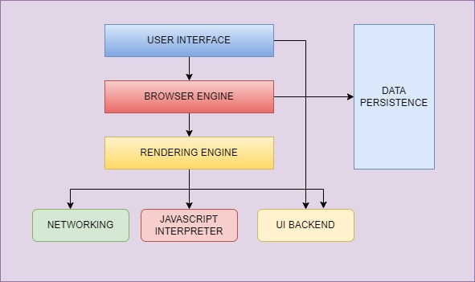
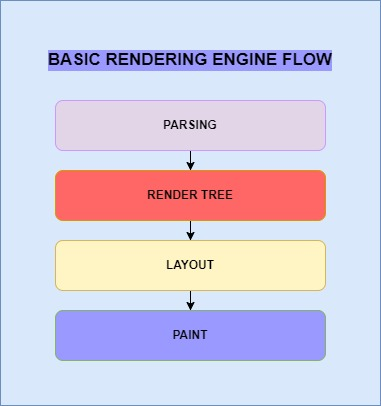

# Pesto Assignment - Exercise 1.1

## a. What is the main functionality of the browser? <br>

A web browser is an application software to access websites. <br> The **main function of a browser** is -

* To **present the web resource** you choose, by **requesting it from the server** and **displaying** it in the browser window.

	* The resource is usually an HTML document, but may also be a PDF, image, or some other type of content.

* The **location of the resource** is specified by the user using a **URI** (Uniform Resource Identifier).

  
---
## b. High Level Components of a browser - <br>



  

### The browser's main components are:

1. **User Interface** : This includes the address bar, back/forward button, bookmarking menu, etc. Every part of the browser display except the window where you see the requested page.

2. **Browser Engine** : This transfers actions between the UI and the rendering engine.

3. **Rendering Engine** : It is responsible for displaying requested content. For example, if the requested content is HTML, the rendering engine parses HTML and CSS, and displays the parsed content on the screen.

4. **Networking** : For network calls such as HTTP requests, using different implementations for different platform behind a platform-independent interface.

5. **UI backend** : It is used for drawing basic widgets like combo boxes and windows. This backend exposes a generic interface that is not platform specific. Underneath it uses operating system user interface methods.

6. **JavaScript interpreter** : It is used to parse and execute JavaScript code.

7. **Data storage**: This is a persistence layer. The browser may need to save all sorts of data locally, such as cookies. Browsers also support storage mechanisms such as localStorage, IndexedDB, WebSQL and FileSystem.
  
---
## c. Rendering engine and its use

The **rendering engine** displays the requested contents on the browser screen. <br>
* By default, the rendering engine can display HTML, XML documents and images. It can display other types of data via plug-ins or extension; for example, displaying PDF documents using a PDF viewer plug-in.

* The rendering engine will start getting the contents of the requested document from the networking layer. This will usually be done in 8kB chunks.

After that, this is the basic flow of the rendering engine:



1. The rendering engine will start parsing the HTML document and convert elements to **DOM**  nodes in a tree called the "content tree". The engine will parse the style data, both in external CSS files and in style elements. 

2. Styling information together with visual instructions in the HTML will be used to create another tree: the **render tree**. 
    * The render tree contains rectangles with visual attributes like color and dimensions. The rectangles are in the right order to be displayed on the screen.
4. After the construction of the render tree it goes through a **layout** process. This means giving each node the exact coordinates where it should appear on the screen. 

5. The next stage is  **painting**  - the render tree will be traversed and each node will be painted using the UI backend layer.

 For **better user experience**, the rendering engine will try to **display contents on the screen as soon as possible**. It will not wait until all HTML is parsed before starting to build and layout the render tree. Parts of the content will be parsed and displayed, while the process continues with the rest of the contents that keeps coming from the network.
 
---
## d. Parsers (HTML, CSS, etc.)
Parsing a document means translating it to a structure the code can use. The result of parsing is usually a tree of nodes that represent the structure of the document. This is called a parse tree or a syntax tree.

### HTML Parser  
The job of the HTML parser is to parse the HTML markup into a parse tree.

For example, parsing the expression `2 + 3 - 1` could return this tree:


### DOM 

The output tree (the "parse tree") is a tree of DOM element and attribute nodes. DOM is short for Document Object Model. It is the object presentation of the HTML document and the interface of HTML elements to the outside world like JavaScript.

The root of the tree is the Document object.

The DOM has an almost one-to-one relation to the markup. For example:
```
<html>  
<body>  
<p>  
Hello World  
</p>  
<div>  </div>  
</body>  
</html>
```
This markup would be translated to the following DOM tree:


**HTML Parsing** algorithm consists of two stages: **tokenization** and **tree construction**.

Tokenization is the lexical analysis, parsing the input into tokens. Among HTML tokens are start tags, end tags, attribute names and attribute values.

The tokenizer recognizes the token, gives it to the tree constructor, and consumes the next character for recognizing the next token, and so on until the end of the input.


### CSS parsing
Unlike HTML, CSS is a context free grammar and can be parsed using the types of parsers.
Each CSS file is parsed into a StyleSheet object. Each object contains CSS rules. The CSS rule objects contain selector and declaration objects and other objects corresponding to CSS grammar.


---
## e. Script Processors
The HTML  `<script>`  tag is used to define a client-side script (JavaScript).

The  `<script>`  element either contains script statements, or it points to an external script file through the  `src`  attribute.

The **Script processor** allows you to specify your own processor logic for a simple processor using JavaScript or Groovy. The script is entered as an option on the script processor.
* The `script` processor executes JavaScript code to process an event. 

The script processor uses the script cache to avoid recompiling the script for each incoming document. To improve performance, ensure the script cache is properly sized before using a script processor in production.

---
## f. Tree construction

When the parser is created the Document object is created. During the tree construction stage the DOM tree with the Document in its root will be modified and elements will be added to it. Each node emitted by the tokenizer will be processed by the tree constructor. For each token the specification defines which DOM element is relevant to it and will be created for this token. The element is added to the DOM tree, and also the stack of open elements. This stack is used to correct nesting mismatches and unclosed tags. The algorithm is also described as a state machine. The states are called "insertion modes".

Let's see the tree construction process for the example input:
```
<html>  
<body>  
Hello world  
</body>  
</html>
```
The input to the tree construction stage is a sequence of tokens from the tokenization stage. The first mode is the  **"initial mode"**. Receiving the "html" token will cause a move to the  **"before html"** mode and a reprocessing of the token in that mode. This will cause creation of the HTMLHtmlElement element, which will be appended to the root Document object.

The state will be changed to  **"before head"**. The "body" token is then received. An HTMLHeadElement will be created implicitly although we don't have a "head" token and it will be added to the tree.

We now move to the  **"in head"**  mode and then to  **"after head"**. The body token is reprocessed, an HTMLBodyElement is created and inserted and the mode is transferred to  **"in body"**.

The character tokens of the "Hello world" string are now received. The first one will cause creation and insertion of a "Text" node and the other characters will be appended to that node.

The receiving of the body end token will cause a transfer to  **"after body"**  mode. We will now receive the html end tag which will move us to **"after after body"** mode. Receiving the end of file token will end the parsing.


---
## g. Order of script processing

### Scripts 

The model of the web is synchronous. Authors expect scripts to be parsed and executed immediately when the parser reaches a  `<script>`  tag. The parsing of the document halts until the script has been executed. If the script is external then the resource must first be fetched from the network - this is also done synchronously, and parsing halts until the resource is fetched. This was the model for many years and is also specified in HTML4 and 5 specifications. Authors can add the "defer" attribute to a script, in which case it will not halt document parsing and will execute after the document is parsed. HTML5 adds an option to mark the script as asynchronous so it will be parsed and executed by a different thread.

---
## h. Layout and Painting

### Layout

When the renderer is created and added to the tree, it does not have a position and size. Calculating these values is called layout or reflow.

HTML uses a flow-based layout model, meaning that most of the time it is possible to compute the geometry in a single pass. Elements later "in the flow" typically do not affect the geometry of elements that are earlier "in the flow", so layout can proceed left-to-right, top-to-bottom through the document. There are exceptions: for example, HTML tables may require more than one pass.

The coordinate system is relative to the root frame. Top and left coordinates are used.

Layout is a recursive process. It begins at the root renderer, which corresponds to the  `<html>`  element of the HTML document. Layout continues recursively through some or all of the frame hierarchy, computing geometric information for each renderer that requires it.

The position of the root renderer is 0,0 and its dimensions are the viewport - the visible part of the browser window.

All renderers have a "layout" or "reflow" method, each renderer invokes the layout method of its children that need layout.

### Painting

In the painting stage, the render tree is traversed, and the renderer's "paint()" method is called to display content on the screen. Painting uses the UI infrastructure component.

#### Global and Incremental

Like layout, painting can also be global - the entire tree is painted - or incremental. In incremental painting, some of the renderers change in a way that does not affect the entire tree. The changed renderer invalidates its rectangle on the screen. This causes the OS to see it as a "dirty region" and generate a "paint" event. The OS does it cleverly and coalesces several regions into one. In Chrome it is more complicated because the renderer is in a different process then the main process. Chrome simulates the OS behavior to some extent. The presentation listens to these events and delegates the message to the render root. The tree is traversed until the relevant renderer is reached. It will repaint itself (and usually its children).

#### The painting order 
CSS2 defines the order of the painting process. This is actually the order in which the elements are stacked in the stacking contexts. This order affects painting since the stacks are painted from back to front. The stacking order of a block renderer is:

1.  background color
2.  background image
3.  border
4.  children
5.  outline

### References 
1. [Kruno: How browsers work | JSUnconf 2017](https://www.youtube.com/watch?v=0IsQqJ7pwhw&t=214s)
2. [How browsers work](https://web.dev/howbrowserswork)